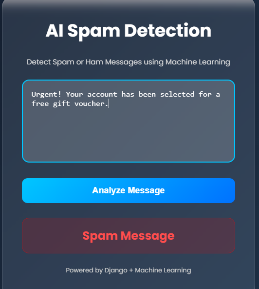
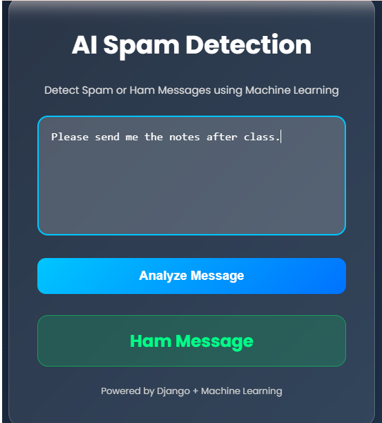

# AI Spam Detection System

A Machine Learning based Spam Detection Web Application built using Python, Django, Pandas, Scikit-learn, and NLP.

This project detects whether a message is Spam or Ham (Not Spam) using a trained Naive Bayes Machine Learning Model with TF-IDF Vectorization and Natural Language Processing (NLP).

---

## Features

- Real-time Spam/Ham message prediction
- Machine Learning model using Naive Bayes
- NLP text preprocessing
- TF-IDF feature extraction
- Beautiful modern UI
- Django backend integration
- Trained model saved using Joblib
- User-friendly interface

---

## Technologies Used

- Python
- Django
- Pandas
- NumPy
- Scikit-learn
- NLTK
- HTML
- CSS
- Joblib

---

## Machine Learning Workflow

```text
Raw Message
   ↓
Text Preprocessing
   ↓
Tokenization
   ↓
Stopwords Removal
   ↓
Stemming
   ↓
TF-IDF Vectorization
   ↓
Naive Bayes Model
   ↓
Spam / Ham Prediction
```

---

## Project Structure

```text
AI-Spam-Detection-System/
│
├── ml_model/
│   ├── train_model.py
│   ├── spam_model.pkl
│   ├── vectorizer.pkl
│   └── SMSSpamCollection
│
├── spam_detection/
│   ├── manage.py
│   ├── predictor/
│   │   ├── templates/
│   │   │   └── index.html
│   │   ├── views.py
│   │   ├── urls.py
│   │   └── models.py
│   │
│   └── spam_detection/
│       ├── settings.py
│       ├── urls.py
│       └── wsgi.py
│
├── requirements.txt
└── README.md
```

---

## Installation

### Clone Repository

```bash
git clone https://github.com/bhaveshpa1234/AI-Spam-Detection-System.git
```

---

### Create Virtual Environment

```bash
python -m venv env
```

Activate environment:

#### Windows

```bash
env\Scripts\activate
```

---

## Install Dependencies

```bash
pip install -r requirements.txt
```

---

## Run ML Training File

Go to `ml_model` folder:

```bash
cd ml_model
```

Run:

```bash
python train_model.py
```

This creates:
- `spam_model.pkl`
- `vectorizer.pkl`

---

## Run Django Server

Go to Django project folder:

```bash
cd ../spam_detection
```

Run server:

```bash
python manage.py runserver
```

Open browser:

```text
http://127.0.0.1:8000/
```

---

## Model Accuracy

```text
Accuracy: 96.7%
```

---

## Example Predictions

| Message | Prediction |
|----------|------------|
| Win FREE cash now!!! | Spam |
| Let's meet tomorrow | Ham |

---

## NLP Techniques Used

- Lowercase Conversion
- Tokenization
- Stopwords Removal
- Punctuation Removal
- Stemming

---

## Future Improvements

- User Authentication
- Prediction History
- Confidence Percentage
- Dark Mode
- REST API using Django REST Framework
- Deployment on Render/Heroku
- Bootstrap/Tailwind UI

---

## Author

Bhavesh Parmar

---

## License

This project is created for learning and educational purposes.

## Screenshots

### Home Page


---

### Spam Prediction



---

### Ham Prediction

